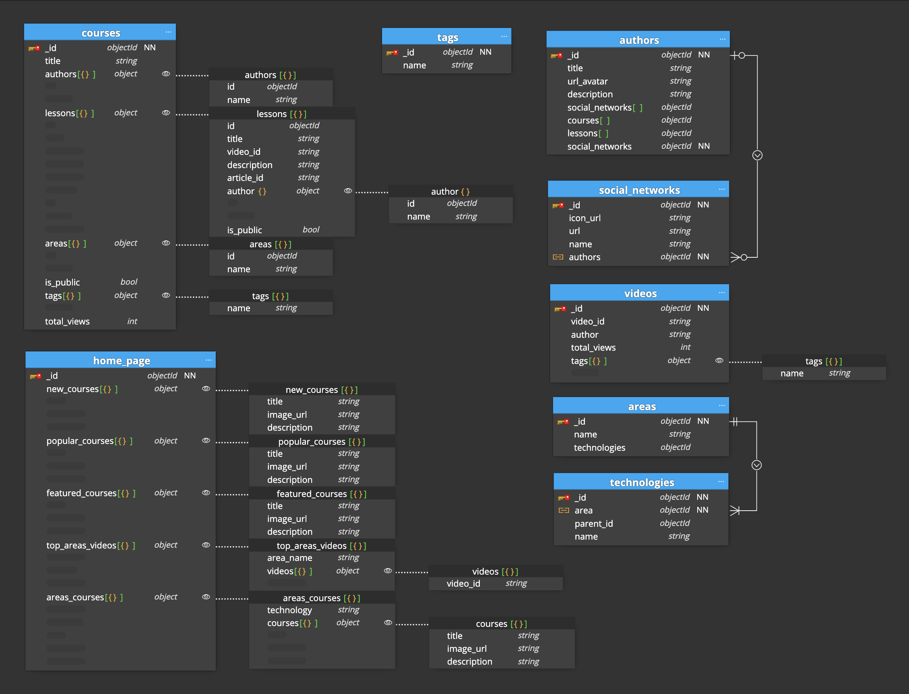
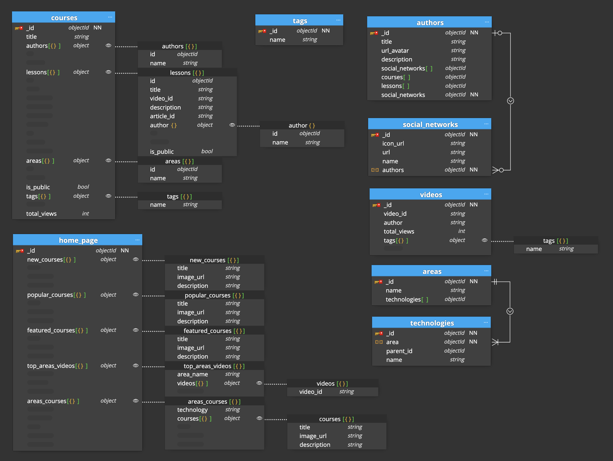

# 00-entrega-modelado

## Modelado básico

Este es el caso básico:
```
./basico/content/laboratorio-modelado-basic.pdf
```



Lo que he tenido en cuenta:

#### Collection courses:

En el workload se comenta que los cursos se van a visitar mucho por lo que interesa que vayan muy rápido y no se gasten muchos ciclos de CPU haciendo "joins" con otras collections para obtener los datos. Para ello propiedades areas o authors, usan el patron `extended ref`, duplicando datos ya que tenemos en otras collecciones, pero ganando en rendimiento de carga.

###### Comentarios sobre algunas propiedades:
- authors: usamos `extended ref`
- areas: usamos `extended ref`
- lessons: Como las `lessons` estan intrinsecamente relacionadas con `courses` y no se van a consultar por separado he preferido anidarlas directamente a `courses`, así de paso también ganamos en velocidad de carga ya que las visitas a las lecciones se espera que sean de las más consultadas. Dentro de lessons usamos también el patrón `extended ref` para author, ya que nos podría interesar que a parte del nombre también tengamos el id para poder generar una url.

#### Collection home_page:

En esta colección se ha usado el patrón `subSet` ya que como se esperan muchas visitas a la home, donde van a haber vídeos, cursos, pero por categorías y con un número limitado, se ha preferido que con una sola consulta ya se puedan tener todos, en vez de consultar con varias collections con el gasto de recursos que comporta.

###### Comentarios sobre algunas propiedades:
- new_courses, popular_courses y featured_courses tienen la misma estructura y sacan detalles con el patrón `subSet` de la collection de `courses`
- top_area_videos: Lo mismo que la propiedad anterior pero sacando información de la collection `areas`y `videos`
- area_courses: Lo mismo pero sacando información de las collections `technologies` y `courses`

#### Collection authors:

Como es una página de la cual no se espera mucha carga se han creados relacions mediante objectId para depende que campos yq ue se puedan sacar con un "join" de mongo.

###### Comentarios sobre algunas propiedades:
- social_networks: no se ha intentado ningún pattern como el `extended ref` porque no se da prioridad al rendimiento, por lo cual se han asociado las ids que se tienen que consultar en la collecion `social_networks` 
- lessons: lo mismo que en la anterior pero con la collecion `lessons` 
- courses: lo mismo que en la anterior pero con la collecion `courses`

#### Collection videos:

Servirá para consultar la página del vídeo. Como no se ha especificado si va a haber unlink al autor desde la página del vídeo no se ha usado un id referencial para hacer un "join" con la collection `author`

#### Collection areas:

Servirá para listar las areas

#### Collection technologies:

Servirá para listar las tecnologías que pertenecen a una categoría

- category tiene una relación de muchos a uno, donde por el momento una tecnología solo puede tener una categoría

#### Collection social_networks:

Servirá para listar las redes sociales dentro del autor

##
## Modelado opcional

Este es el caso opcional:
```
./opcional/content/laboratorio-modelado-opcional.pdf
```


Estas son las modificaciones que se han hecho para solventar los requerimientos opcionales del ejercicio.

#### Collection courses:

- Como se ha pedido que los cursos pueden ser públicos o de suscripción, se ha añadido el campo `is_public`que permitirá indicar si el curso es público o no.
También se ha añadido el mismo campo en `lessons` para que en el caso que un curso sea parte público y pate privado, se puedan distinguir las lecciones de la que lo componen.
- Se ha añadido siguiendo el modelo `extended ref`, para seguir con una carga rapida de la información, la propiedad `tags` donse se indica un array de tags.
- Se ha añadido un campo `total_views` que será modificado con algún proceso de servidor cada X tiempo, para contabilizar la cantidad de visualizaciones que hay del total de vídeos que conforman el curso.

#### Collection videos:

- Se ha añadido un campo `total_views` que será modificado con algún proceso de servidor cada X tiempo, para contabilizar la cantidad de visualizaciones que hay de este vídeo.
- Se ha añadido siguiendo el modelo `extended ref`, para seguir con una carga rapida de la información, la propiedad `tags` donse se indica un array de tags.

#### Collection technologies:

- Como se ha pedido una estructura jerárquica más avanzada para poder anidar más tipos de categorizaciones se ha usado el patrón `tree category` donde siempre se indica la relación de un `parent_id` en el caso que exista, así siempre puedes, mediante un método recursivo sacar todo el arbol de tecnologías según su jerarquía.